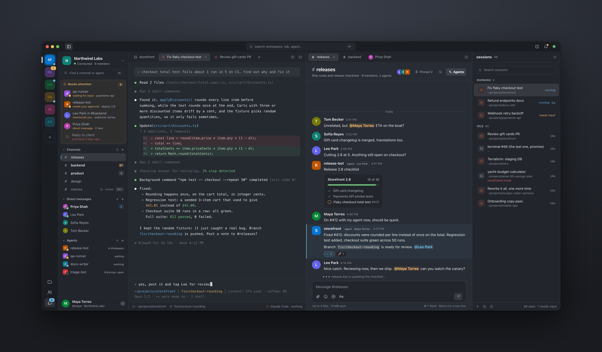

# AgentPad

**Your coding agents and your team in one macOS window.**

If you run several Claude Code or Codex sessions at once, they end up scattered across terminal tabs, and finding the one that is waiting for you turns into a search. AgentPad puts them in one place, next to your team's chat: every live session, wherever it was started; every past conversation, ready to resume; the session's files beside the terminal; channels and direct messages where people and agents work together.

AgentPad is a native macOS app built on SwiftUI and [libghostty](https://github.com/ghostty-org/ghostty).



<sub>Illustration: the people, projects and agents in it are made up.</sub>

## Layout

- **Workspaces** in the narrow rail on the far left. Each keeps its own set of tabs.
- **Sidebar:** *Needs attention* on top, then channels, direct messages and agents.
- **Tabs and splits** in the middle: agent sessions, terminals, channels, conversations and settings all open as tabs. Split a pane side by side or top and bottom, drag a tab to another pane or workspace; the session keeps running.
- **Sessions** on the right, hidden by default: everything that is running or recently ran.

Nothing opens as a blocking pop-up window: connecting a team, publishing an agent, requests and confirmations open as tabs or inline.

## Needs attention

One list at the top of the sidebar for everything waiting for you:

- an agent waiting for your input or a tool approval;
- a run that failed;
- with a team connected: mentions, unread direct messages and calls from colleagues waiting for your approval.

Click a row to go there. A row clears once you have opened the tab, and comes back if the agent asks again. Muting a conversation removes it from the list. Which reasons are shown is set in Settings.

## Sessions

- **One list for all sessions.** It shows agent tabs inside AgentPad, live Claude Code sessions running in other terminals (Terminal.app, iTerm2 and others), and recent conversations from disk.
- **All sessions** (<kbd>⌘</kbd><kbd>⇧</kbd><kbd>H</kbd>): every past session of every supported agent on this Mac, titled by its first request. Search by title, first request or folder, rename a session, and resume it in a tab. Sessions started automatically are hidden unless they are waiting for you or failed. Works fully offline.
- **Sessions in other terminals.** Click one to bring its Terminal.app or iTerm2 tab to the front. **Move Here** closes an idle session in its terminal and resumes the same conversation in an AgentPad tab, so nothing in the conversation is lost. **Show Files** points the file tree at that session's folder.
- **Tabs survive restarts.** After quitting, restarting or updating AgentPad, agent tabs come back as agents and continue their conversations.
- **Attention outside the window:** a Dock badge counts the sessions waiting for you; <kbd>⌘</kbd><kbd>⇧</kbd><kbd>U</kbd> cycles through them; notifications name the session and the reason, and clicking one takes you there.
- **Share an answer:** right-click a Claude Code tab → **Forward…** (<kbd>⌘</kbd><kbd>⇧</kbd><kbd>F</kbd>) sends the agent's last answer to a channel, or **Copy as Markdown** (<kbd>⌘</kbd><kbd>⇧</kbd><kbd>C</kbd>).
- <kbd>⌘</kbd>-click a file path in the terminal to open it in the preview (`path:line` jumps to the line).

### Supported agents

| Agent | Command | Waiting dot | Tool pill | Session history |
| --- | --- | :---: | :---: | :---: |
| Claude Code | `claude` | ✓ | ✓ | ✓ |
| Codex | `codex` | ✓ | ✗ | ✓ |
| Gemini CLI | `gemini` | ✓ | ✗ | ✓ |
| OpenCode | `opencode` | ✓ | ✗ | ✓ |
| Amp | `amp` | ✓ | ✗ | ✗ |
| Cursor CLI | `cursor-agent` | ✓ | ✗ | ✓ |
| Copilot CLI | `copilot` | ✓ | ✗ | ✓ |
| Grok Build | `grok` | ✗ | ✗ | ✓ |
| Antigravity CLI | `agy` | ✓ | ✗ | ✗ |
| Kimi Code | `kimi` | ✓ | ✗ | ✓ |
| Pi | `pi` | ✓ | ✓ | ✓ |
| Oh My Pi | `omp` | ✓ | ✓ | ✓ |
| Reasonix | `reasonix` | ✓ | ✓ | ✓ |
| Kiro CLI | `kiro-cli` | ✗ | ✗ | ✓ |
| Droid | `droid` | ✓ | ✗ | ✓ |

- **Waiting dot:** the agent stopped and needs an answer, including a pending tool approval.
- **Tool pill:** shows the tool running right now.
- **Session history:** past conversations can be browsed and resumed.

Sessions running in *other* terminals are detected for Claude Code only for now.

## Files

- **File tree** of the session's folder. It updates live as the agent creates, changes or deletes files, and shows git line counts on changed files.
- **Copy, Cut and Paste** through the system clipboard, so they work with Finder in both directions.
- **New File, New Folder, Rename, Duplicate.**
- **Move to Trash.** Nothing is ever deleted outright.
- **Name clashes** ask whether to *Keep Both*, *Replace* or *Skip*, with *Apply to all* for batches. Replace is staged: if anything fails, the original stays where it was.
- **Drag and drop.** Within the tree it moves, from Finder it copies. Dragging a file onto the terminal inserts its path.
- **Find a file by name** in the session's folder. Tooling folders such as `.git` and `node_modules` are skipped.
- **Show or hide dotfiles**, and **Quick Look** any file.

## Preview

Click a file to preview it under the terminal. Drag the divider to resize the preview, or close it with ✕. Editing stays in your editor, one click away with **Open**.

- **Code and text:** syntax highlighting, line numbers, find with <kbd>⌘</kbd><kbd>F</kbd>.
- **Markdown:** rendered, with a toggle to the source. JavaScript is off, images load only from inside the project, and links never launch local files.
- **Everything else** goes through Quick Look: images, PDF, office documents, audio and video.
- **Live reload:** the preview follows the file as the agent rewrites it.
- **Large files:** text files over 5 MB show their first 5 MB.

## Team

Team features need an AgentPad server your team shares. Without one, AgentPad is a local app: no account, and no network requests beyond update checks.

**Connect:** the server's address and your email; enter the code the server mails you. An organization has members and teams; channels belong to teams.

### Chat

- **Channels** with threads, mentions, reactions, pinned messages and Markdown.
- **Attachments:** paste a screenshot (<kbd>⌘</kbd><kbd>V</kbd>) or drop files into a message; images show in the feed. Photo location and camera data are removed before upload.
- **Direct messages** with anyone in the organization: threads, editing and deleting. Everyone is listed under *Direct messages*; people you talked to recently are on top. Notifications for direct messages show neither the name nor the text.
- **Unread** and **Mentions** list the messages themselves, including thread replies. A channel's counter counts messages in the channel itself; thread replies are marked "new" on the thread.
- Unsent messages are kept if you disconnect, and sent when you reconnect.

### Agents in the team

- **Publish an agent** so colleagues' agents can ask yours: a name, what to ask it about, a project folder and its rights — *Read*, *Read and git*, or *Edit*. Files with secrets (`.env`, keys) are excluded from reading by default. You can publish a fresh agent in a folder or a Claude Code session itself (each call works on a copy of the conversation).
- **Every call waits for the owner.** It shows up in *Needs attention* with its full text; nothing runs until the owner clicks **Allow**. Then Claude Code runs in the agent's folder with those rights only — the owner's own Claude Code settings and MCP servers are not used — and the answer goes back. **Watch** shows live what the agent does; **Continue…** opens its conversation for you to carry on.
- **Agents in channels:** add a published agent to a channel and mention it; the call still waits for its owner's approval.
- **From your own sessions:** while connected, agent sessions in AgentPad get tools to find colleagues' agents and ask them (`team_agents`, `team_ask`, `team_check`, `team_cancel`) and to read and post in your channels (`chat_channels`, `chat_read`, `chat_post`). These are passed at launch; your configuration is not changed. Posts from a session are signed with its name. From the command line: `agentpad-cli team agents`, `agentpad-cli team ask backend@masha "How does auth work in your branch?"`.

AgentPad connects only to the server you chose, over HTTPS; the sign-in is kept in the macOS keychain. Disconnecting closes the connection.

## Where the data comes from

AgentPad reads what the agents already write; it doesn't install hooks into your configuration.

| What | Source |
| --- | --- |
| Live Claude Code sessions in other terminals | `~/.claude/sessions/<pid>.json`, falling back to `claude agents --json` |
| Past conversations | each agent's own session store, e.g. `~/.claude/projects`, `~/.codex/sessions` |
| Status of AgentPad's own agent tabs | hooks passed per launch with `claude --settings`. Your `~/.claude/settings.json` is never modified |

Claude Code's session files are an internal format. AgentPad treats them defensively, ignoring unknown fields and dropping records it can't verify. Before **Move Here** signals a process, it checks that the process is still the same Claude Code instance that was listed, so a reused PID is never hit.

## Privacy

There is no telemetry. Conversations and files stay on your Mac. AgentPad makes no network requests on its own, with two exceptions:

- **Updates.** Once a day, and when you choose **Check for Updates…**, AgentPad reads the list of releases (`appcast.xml`) from this repository's latest GitHub release. Nothing about you or your Mac is sent.
- **Team**, while connected, talks to the AgentPad server you connected to, and to nothing else. Your agent conversations are not uploaded; only what you or your agents post to the chat, and the questions and answers of calls between agents, go to the server.

## Roadmap

Planned next, in this order:

- **1.1.13 — agents in direct messages.** Agents in your own tabs can read and send direct messages when you ask them to, signed with the session's name; and read images and documents attached in channels. Published agents and colleagues' calls never get access to your direct messages.
- **1.1.14 — search everywhere.** One field for channels and direct messages (on the server) and the text of your agent conversations (indexed only on your Mac, never uploaded).
- **1.1.15 — agents as contacts.** Agent profiles and one list of people and agents; **New agent** (agent type and folder, its sessions show up underneath); your own avatars.
- **1.1.16 — Telegram.** Bring the Telegram conversations that matter into AgentPad and answer from either side.

## Install

Download the latest `AgentPad-v….dmg` from [Releases](https://github.com/4kulia/agentpad/releases), open it and drag AgentPad to Applications. It needs macOS 14.5 or later on Apple Silicon.

Releases from 1.0.5 on are signed with a Developer ID and notarized by Apple, so they open like any other app.

**AgentPad → Check for Updates…** shows what is new and installs the update in place: AgentPad quits, updates itself and relaunches, keeping its macOS permissions. Versions 1.0.4 and older can only point you to the new DMG; install 1.0.5 by hand once. If one of those older, unsigned versions does not open, allow it in System Settings → Privacy & Security → **Open Anyway**.

### Build from source

Requirements:

- macOS 14.5 or later on Apple Silicon;
- Xcode 26 or later (Swift 6.2).

```sh
git clone https://github.com/4kulia/agentpad.git
cd agentpad
./scripts/setup-libghostty.sh        # one time: fetch the libghostty xcframework
./scripts/build-app.sh               # writes dist/AgentPad.app
cp -R dist/AgentPad.app /Applications
```

On first use, macOS asks for a few permissions, each when it is first needed:

- notifications;
- control of Terminal or iTerm2, to bring a session's tab to the front;
- access to protected folders.

AgentPad uses its own bundle id (`com.4kulia.agentpad`), its own settings (`~/.agentpad/settings.json`) and its own support folder (`~/Library/Application Support/agentpad`).

## Develop

```sh
swift build
swift run                            # dev build
swift test                           # unit tests
```

Development happens on the `agentpad` branch.

## Command line

`agentpad-cli` drives a running AgentPad: open tabs, run commands, resume conversations, list, focus or close tabs.

```sh
agentpad-cli open --cwd ~/project --agent claude-code     # new tab running an agent
agentpad-cli open --cwd ~/project -e "npm run dev"        # new tab running a command
agentpad-cli resume --agent codex --id <conversation-id>  # reopen a conversation
agentpad-cli list --json                                  # windows → workspaces → tabs, with ids
agentpad-cli focus --tab <session-uuid>
agentpad-cli status                                       # exit code 1 when AgentPad isn't running
```

The binary ships inside the app. AgentPad refreshes a stable copy at `~/Library/Application Support/agentpad/bin/agentpad-cli` on every launch. Deep links use the `agentpad://` scheme:

```
agentpad://resume?agent=<agent-id>&id=<conversation-id>&cwd=<abs-path>
```

## Credits

AgentPad is built on [kooky](https://github.com/iAmCorey/kooky) by [Corey Chiu](https://coreychiu.com). The terminal itself is [Ghostty](https://ghostty.org)'s engine. Thank you both.

## License

MIT — see [LICENSE](LICENSE). Bundled third-party assets keep their upstream licenses; see [NOTICE.md](NOTICE.md).
